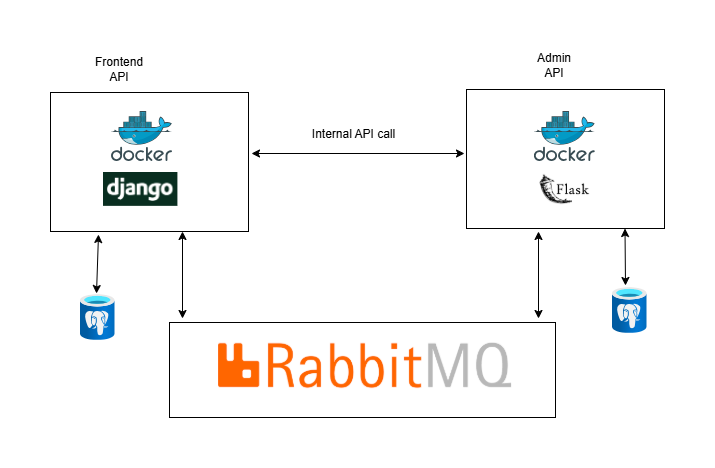

# Library Management System

This repo is a documentation for two independent API services designed to manage books in a library. The APIs communicate with each other using Amazon MQ RabbitMQ message queues and are deployed to AWS ECS.

Project Architecture

## Architecture Overview
- **Frontend API (Django)**: Allows users to enroll into the library, browse books, borrow books, and filter books by publisher and category.
- **Admin API (Flask)**: Enables admins to add and remove books from the catalogue , view enrolled users, view users with borrowed books and view the books that are not available for borrowing (showing the day it will be available).
- **Message Queue**: Amazon MQ RabbitMQ facilitates communication between the two services.
- **Deployment**: Both APIs are containerized with Docker and deployed on Amazon ECS using two ECS services behind an Application Load Balancer (ALB).

## Technologies Used
- Django (Frontend API)
- Flask ([Admin API](https://github.com/george-ajayiola/admin-api-flask))
- Amazon MQ RabbitMQ
- AWS ECS (Elastic Container Service)
- AWS ALB (Application Load Balancer)
- Docker

## How Communication Works
1. When a new book is added or removed via the Admin API, an event is published to RabbitMQ.
2. The Frontend API listens for these events and updates its catalogue accordingly.
3. The connection is established over TLS for secure communication with RabbitMQ.

## Deployment
1. Build Docker images and push them to Docker Hub.
2. Deploy both services to AWS ECS with separate task definitions.
3. Configure Amazon MQ RabbitMQ for message brokering.
4. Use Application Load Balancer to route traffic to the ECS services.

